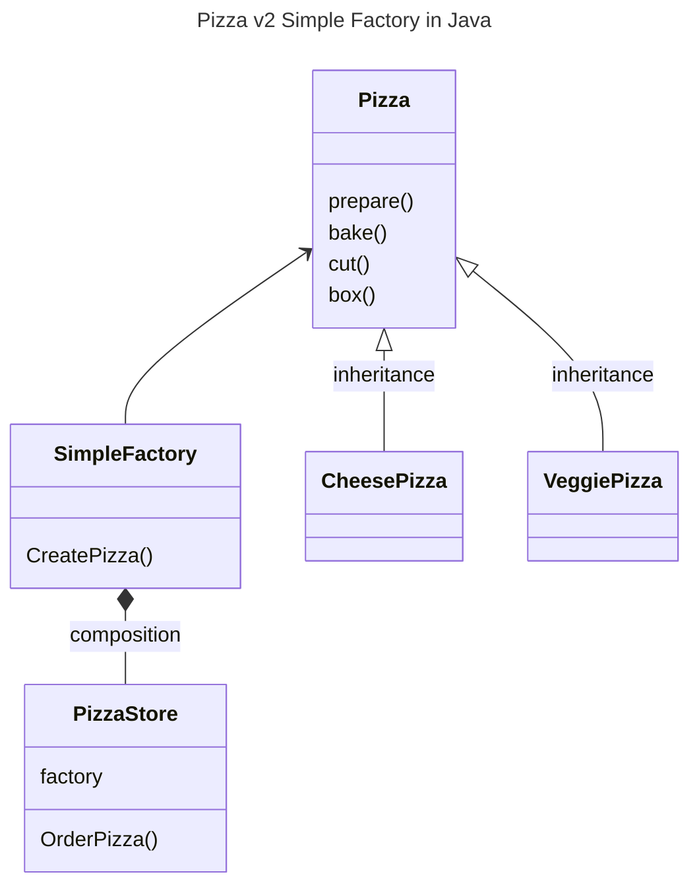
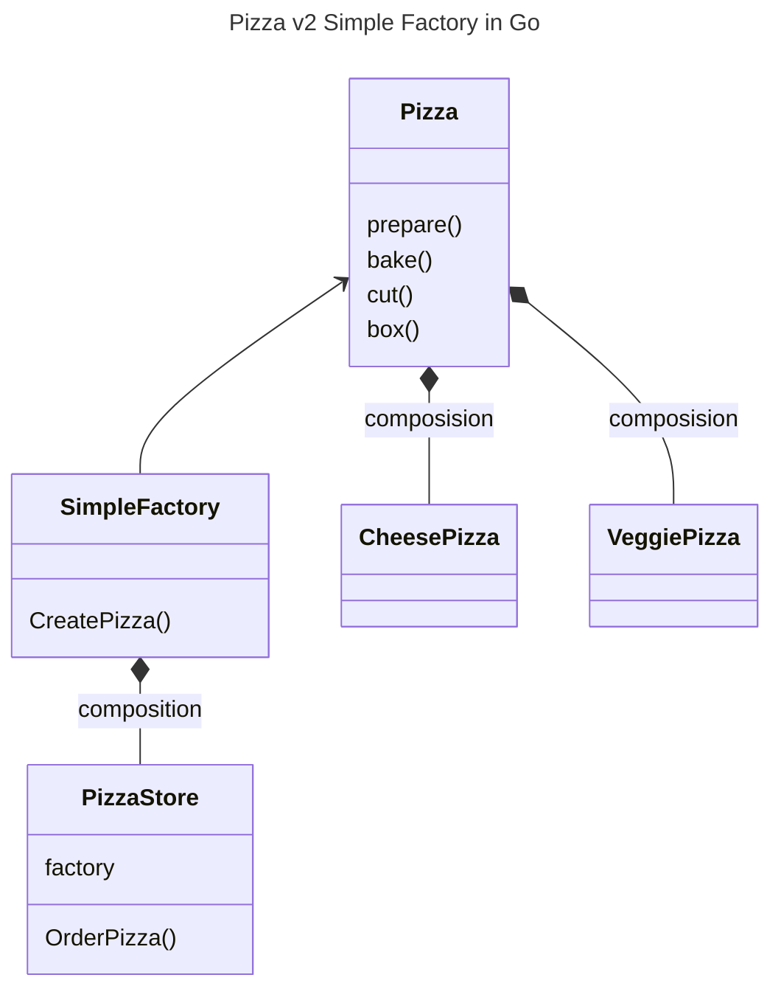
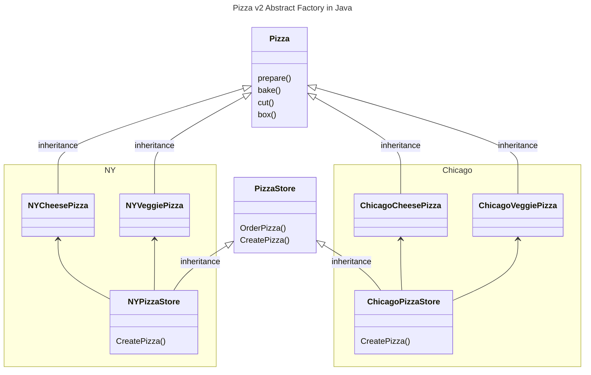
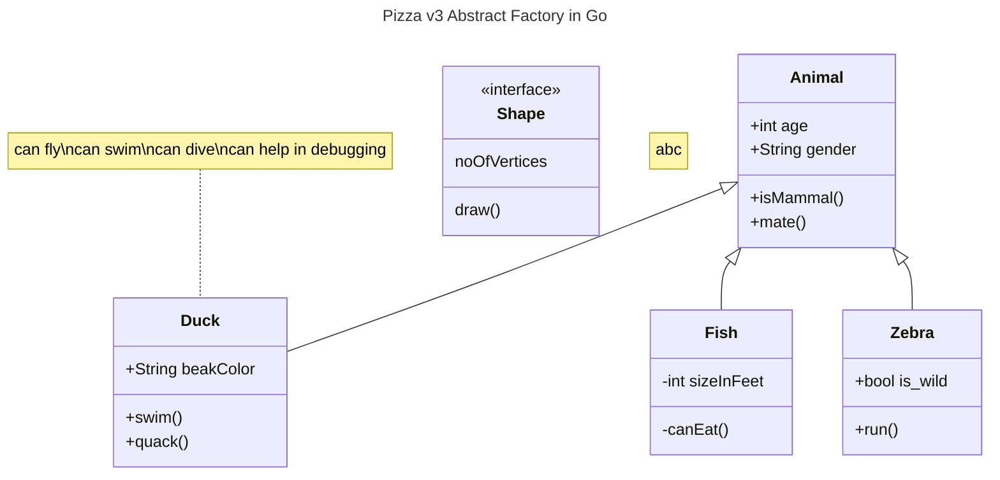

# Abstract Factory

## v2: Simple Factory

### Java

```mermaid
---
title: Pizza v2 Simple Factory in Java
---
classDiagram
    SimpleFactory *-- PizzaStore : composition
    Pizza <-- SimpleFactory
    Pizza <|-- CheesePizza : inheritance
    Pizza <|-- VeggiePizza : inheritance

    class SimpleFactory{
        CreatePizza()
    }

    class PizzaStore {
        factory
        OrderPizza()
    }

    class Pizza {
        prepare()
        bake()
        cut()
        box()
    }
```

### Go

```mermaid
---
title: Pizza v2 Simple Factory in Go
---
classDiagram
    SimpleFactory *-- PizzaStore : composition
    Pizza <-- SimpleFactory
    Pizza *-- CheesePizza : composision
    Pizza *-- VeggiePizza : composision

    class SimpleFactory{
        CreatePizza()
    }

    class PizzaStore {
        factory
        OrderPizza()
    }

    class Pizza {
        prepare()
        bake()
        cut()
        box()
    }
```

## v3: Abstract Factory

### Java

```mermaid
---
title: Pizza v2 Abstract Factory in Java
---
classDiagram
    Pizza <|-- NYCheesePizza : inheritance
    Pizza <|-- NYVeggiePizza : inheritance
    Pizza <|-- ChicagoCheesePizza : inheritance
    Pizza <|-- ChicagoVeggiePizza : inheritance
    PizzaStore <|-- NYPizzaStore: inheritance
    PizzaStore <|-- ChicagoPizzaStore: inheritance

    NYCheesePizza <-- NYPizzaStore
    NYVeggiePizza <-- NYPizzaStore
    ChicagoCheesePizza <-- ChicagoPizzaStore
    ChicagoVeggiePizza <-- ChicagoPizzaStore

    class PizzaStore {
        OrderPizza()
        CreatePizza()
    }

    class Pizza {
        prepare()
        bake()
        cut()
        box()
    }

    namespace NY {
        class NYPizzaStore {
            CreatePizza()
        }
        class NYCheesePizza
        class NYVeggiePizza
    }

    namespace Chicago {
        class ChicagoPizzaStore {
            CreatePizza()
        }
        class ChicagoCheesePizza
        class ChicagoVeggiePizza
    }
```

### Go

```mermaid
---
title: Pizza v3 Abstract Factory in Go
---
classDiagram
    note "abc"
    Animal <|-- Duck
    note for Duck "can fly\ncan swim\ncan dive\ncan help in debugging"
    Animal <|-- Fish
    Animal <|-- Zebra
    Animal : +int age
    Animal : +String gender
    Animal: +isMammal()
    Animal: +mate()
    class Shape{
        <<interface>>
        noOfVertices
        draw()
    }

    class Duck{
        +String beakColor
        +swim()
        +quack()
    }
    class Fish{
        -int sizeInFeet
        -canEat()
    }
    class Zebra{
        +bool is_wild
        +run()
    }
```
